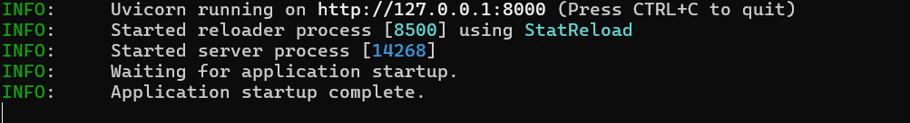
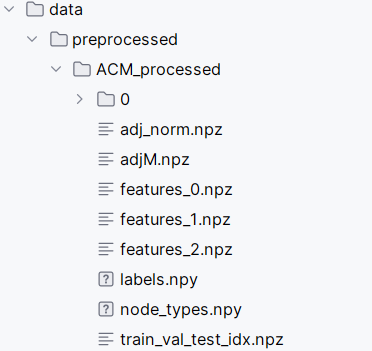

（1）简介

随着图数据的广泛应用，图神经网络（Graph Neural Network，GNN）因其在处理非欧几里德结构数据时的强大表现能力，成为当前研究热点。GNN 通过消息传递和聚合机制，能够学习节点、边的高层泛化表示，广泛应用于节点分类、节点聚类、链路预测等任务。然而，在许多环境中，节点属性缺失情况常常出现，对模型的表现和评估造成显著影响。现有的属性补全方法有一定成效，但存在如下限制：未充分利用邻域节点信息；未分析不同邻域节点的重要性；无法通过任务的逆向传播来优化补全策略。针对上述问题，本文提出了一种新型属性补全策略：

①属性补全
利用一阶邻域节点属性；基于元图和元路形成高阶补全信息；融合多种维度的信息，接近真实属性。

②语义感知卷积层 (SACL)
经由元路/元图计算节点间相似度；结合 attention 机制进行聚合；对各种类型节点均进行强化。

③局部邻域聚合
进行一阶节点聚合；采用语义和关系感知双attention；提升局部信息的补全效果。

（2）模型核心代码

```python
for epoch in range(num_epochs):
    # training
    t = time.time()
    net.train()
    train_loss_avg = 0
    logits, _, loss_ac = net((adjM, features_list, type_mask),s)
    logp = F.log_softmax(logits, 1)
    loss_classification = F.nll_loss(logp[train_idx], labels[train_idx])
    train_loss = loss_classification + 2.5*loss_ac
    # auto grad
    optimizer.zero_grad()
    train_loss.backward()
    optimizer.step()
    train_time = time.time() - t
    train_step += 1
    # print(u'当前进程的内存使用:%.4f GB' % (psutil.Process(os.getpid()).memory_info().rss / 1024 / 1024 / 1024))
    scheduler.step(train_step)
    # validation
    t = time.time()
    net.eval()
    val_loss = 0
    with torch.no_grad():
        logits, _, _ = net((adjM, features_list,type_mask),s)
        logp = F.log_softmax(logits, 1)
        val_loss = F.nll_loss(logp[val_idx], labels[val_idx])
        val_time = time.time() - t
    # early stopping
    early_stopping(val_loss, net)
    if early_stopping.early_stop:
        # print('Early stopping!')
        break
```

（3）FastAPI设计

| 接口              | 方法 | 描述                                            |
| ----------------- | ---- | ----------------------------------------------- |
| `/label/{}`       | GET  | 返回指定节点（指定节点id替代node_id）的分类结果 |
| `/image/1`        | GET  | 返回节点聚类图片                                |
| `/neighbors/{id}` | GET  | 返回节点邻域节点                                |


具体如下：

```python
@app.get("/label/{node_id}")
def get_label(node_id: int):
    if not (0 <= node_id < len(labels)):
        raise HTTPException(404, detail="Node ID out of range")
    return {"node_id": node_id, "label": int(labels[node_id][1])}

@app.get("/image/1")
def get_image(): 
    image_path = "data/images/1.png"
    if not os.path.exists(image_path):
        raise HTTPException(404, detail="Image not found")
    return FileResponse(image_path, media_type="image/png")

@app.get("/neighbors/{node_id}")
def get_neighbors(node_id: int):
    if node_id < 0 or node_id >= adj_matrix.shape[0]:
        raise HTTPException(404, detail="Node ID out of range")
    neighbors = np.nonzero(adj_matrix[node_id])[0].tolist()
    return {"node_id": node_id, "neighbors": neighbors}
```



（4）flutter应用设计

首先有一个登录注册的页面需要登录注册才能够使用，登陆后，里面有一个主页面，有五个功能：论文搜索、论文分类、聚类显示、论文邻域聚合、论文/作者相似度查询，这些功能都是基于调用上面的FastAPI和使用tidb数据库完成的。


（7）数据集：使用acm数据集


